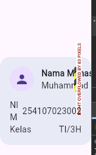
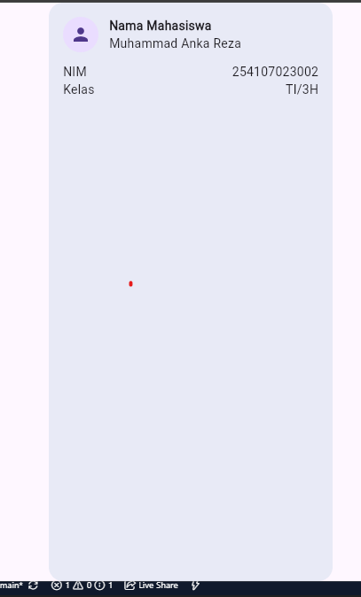

# 02 Week 2 - Declarative UI & Responsive Design

Pada praktikum kali ini saya akan melanjutkan pada week 2, mengenai declarative UI dan responsive design, Praktikum kali ini mempelajari tentang pendekatan deklaratif yang berfokus dengan hubungan data dan tampilan, mempelajari material 3 dan cupertino, responsive layout untuk menyesuaikan sturktur ui dengan ruang yang tersedia, dan tema gelap terang serta accessibility

## Praktikum, layout sederhana warm UP 

pada 
[main.dart](/lib/main.dart)
sebelum membuat dashboard, kita lakukan warm up dahulu, terdapat 4 eksperiment pada warm up (disertakan dengan hasilnya juga)

### Eksperiment warm UP

1. Hapus Expanded pada baris nama, lalu amati peringatan overflow atau perilaku layout-nya; kembalikan setelah itu.

2. Ganti mainAxisSize: MainAxisSize.min menjadi nilai default dan amati perubahan tinggi kartu.

3. Tambahkan satu baris data (misal Email) menggunakan pola Row + Expanded yang sama.

