# 02 Week 2 - Declarative UI & Responsive Design

Pada praktikum kali ini saya akan melanjutkan pada week 2, mengenai declarative UI dan responsive design, Praktikum kali ini mempelajari tentang pendekatan deklaratif yang berfokus dengan hubungan data dan tampilan, mempelajari material 3 dan cupertino, responsive layout untuk menyesuaikan sturktur ui dengan ruang yang tersedia, dan tema gelap terang serta accessibility


## Praktikum, layout sederhana warm UP 

pada 
[main.dart](/lib/main.dart)
sebelum membuat dashboard, kita lakukan warm up dahulu, terdapat 4 eksperiment pada warm up (disertakan dengan hasilnya juga)

### Eksperiment warm UP

1. Hapus Expanded pada baris nama, lalu amati peringatan overflow atau perilaku layout-nya; kembalikan setelah itu.


2. Ganti mainAxisSize: MainAxisSize.min menjadi nilai default dan amati perubahan tinggi kartu.


3. Tambahkan satu baris data (misal Email) menggunakan pola Row + Expanded yang sama.


### Praktikum: dashboard responsif


1. Ubah breakpoint dari 700 menjadi nilai lain dan amati perubahan jumlah kolom.

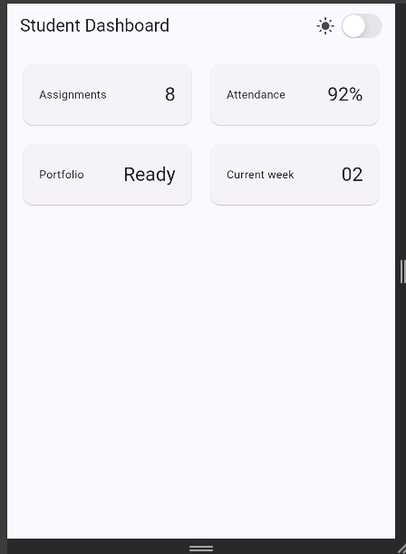

2. Ubah themeMode menjadi ThemeMode.dark, lalu kembalikan ke ThemeMode.system.

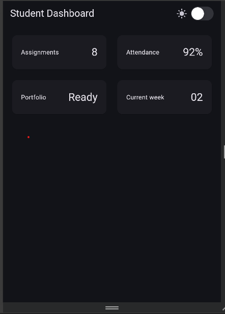

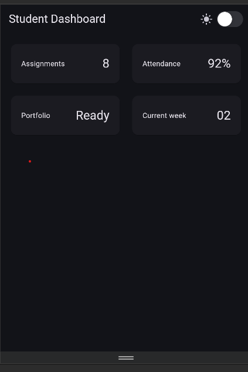

3. Uji aplikasi dengan ukuran layar emulator yang berbeda.

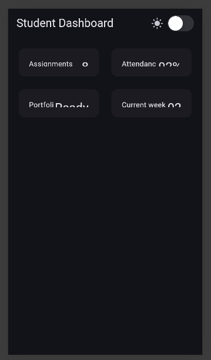

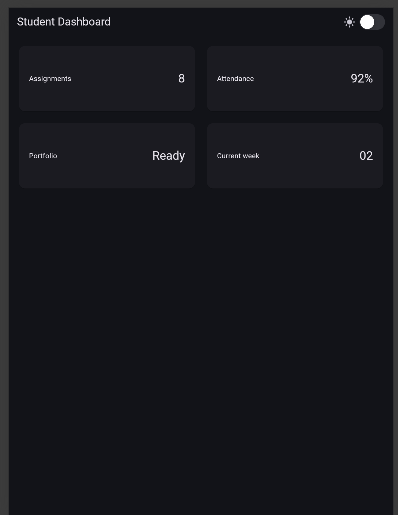

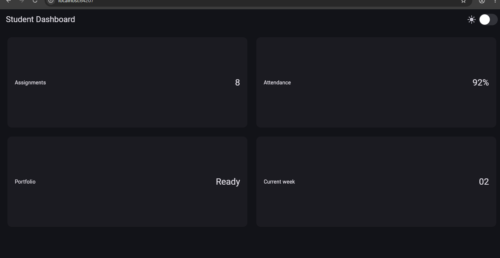

4. Tambahkan Semantics atau label yang bermakna pada elemen yang penting bagi screen reader.

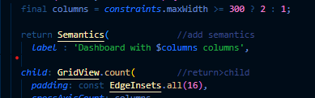


### Tugas dan AI design exploration

Tugas utama
Kembangkan dashboard menjadi halaman Academic Overview dengan ketentuan:

- Memiliki header profil dan minimal empat kartu informasi.
- Menggunakan Row, Column, Expanded, dan Container.
- Menampilkan satu kolom pada layar sempit dan dua kolom pada layar lebar.
- Menyediakan light theme dan dark theme yang tetap terbaca, dengan toggle tema (misal CupertinoSwitch atau Switch adaptive).
- Memiliki label aksesibilitas untuk informasi atau tombol penting.
- Menyertakan screenshot layar sempit dan lebar pada folder screenshots/.

Jawaban :

Implementasi dashboard menggunakan `LayoutBuilder` dan `Column`. Header profil berada di bagian atas, sedangkan empat kartu informasi ditampilkan menggunakan `GridView`. Pada layar sempit kartu tersusun dalam satu kolom, sedangkan pada layar lebar kartu tersusun dalam dua kolom.

#### Layar sempit: satu kolom

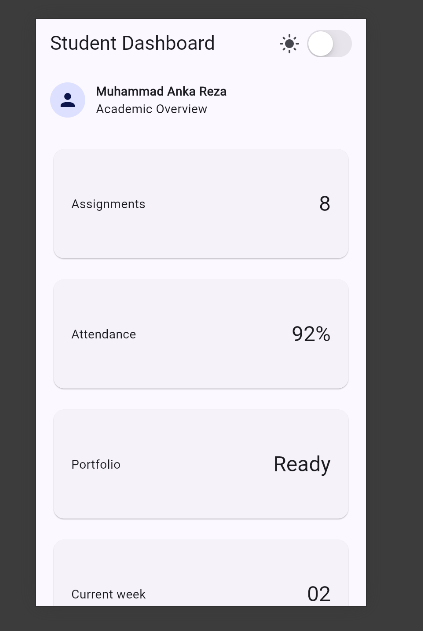

#### Layar lebar: dua kolom

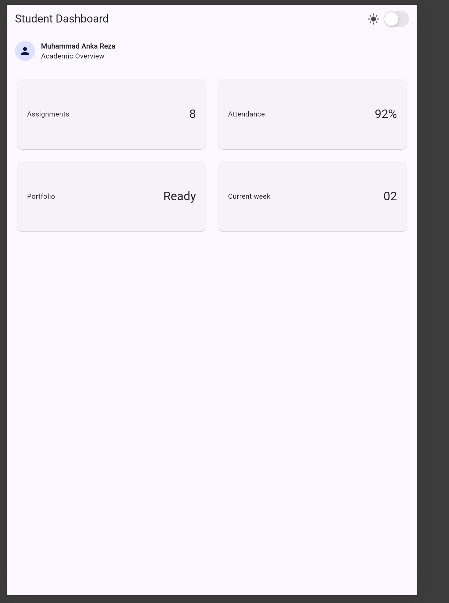


Implementasi terbaru menampilkan header profil, empat `InfoCard`, toggle tema,
dan layout satu kolom pada layar sempit. Pada layar yang lebih lebar, kartu
ditampilkan dalam dua kolom.


## AI Prompt Challenge
### Prompt desain
Prompt yang digunakan:

```text
Bandingkan dua tata letak dashboard akademik untuk Flutter: versi GridView dan versi LayoutBuilder + Column. Jelaskan trade-off responsif dan aksesibilitasnya.
```

Ringkasan output AI:

- `GridView` cocok untuk menampilkan beberapa kartu dalam pola grid dan dapat diberi jumlah kolom berdasarkan lebar layar.
- `LayoutBuilder + Column` cocok untuk menyusun halaman secara vertikal, misalnya header profil di atas dan grid kartu di bawahnya.
- Keduanya tetap responsif jika breakpoint ditentukan dari `constraints.maxWidth` dan konten diberi batas ruang yang sesuai.
- Aksesibilitas tidak otomatis lebih baik hanya karena memakai salah satu layout. Label bermakna dengan `Semantics` tetap perlu ditambahkan pada kontrol tema dan informasi penting.

Keputusan yang dipilih: menggunakan `LayoutBuilder + Column` sebagai struktur halaman dan `GridView.count` untuk kartu informasi. `Column` menempatkan header profil di atas, sedangkan `GridView` memudahkan perubahan dari satu kolom ke dua kolom. Breakpoint implementasi ditetapkan pada `600px`.

### Prompt penguatan konsep

Prompt yang digunakan:

```text
Jelaskan kapan penggunaan Expanded justru menyebabkan overflow di dalam Row, beri contoh kode yang gagal dan perbaikannya.
```

Ringkasan output AI:

`Expanded` dapat menyebabkan overflow jika ukuran minimum anak lebih besar daripada ruang yang tersedia, jika beberapa widget fleksibel memaksa ukuran minimum yang terlalu besar, atau jika `Expanded` ditempatkan di dalam parent yang tidak memberikan batas pada sumbu utama. Contoh perbaikan adalah membatasi teks dengan `Expanded` atau `Flexible`, menggunakan `Text` yang dapat melakukan wrapping, dan memastikan parent memberikan constraint yang valid.

Pada implementasi ini, `Expanded` pada judul kartu dan grid digunakan di dalam parent yang memiliki constraint dari `Row`, `Column`, dan `Scaffold`, sehingga tidak menimbulkan overflow pada ukuran layar yang diuji.

### Verification prompt

Prompt yang digunakan:

```text
Periksa kembali rekomendasi layout di atas: apakah tetap responsif di bawah 600px, apakah mengurangi aksesibilitas, dan apakah ada widget yang tidak tersedia di Flutter stabil saat ini?
```

Hasil verifikasi:

- Di bawah `600px`, `crossAxisCount` bernilai `1`, sehingga kartu ditampilkan satu kolom.
- Pada lebar `600px` atau lebih, `crossAxisCount` bernilai `2`.
- `Semantics` pada switch tema dan dashboard mempertahankan informasi yang dapat dibaca screen reader.
- `CupertinoSwitch`, `LayoutBuilder`, `GridView`, `Column`, `Row`, `Expanded`, dan `Container` tersedia pada Flutter stable.
- Rekomendasi tidak menggantikan pengujian langsung. Aplikasi tetap perlu diperiksa dengan `flutter analyze` dan screenshot pada ukuran layar sempit serta lebar.

### Dokumentasikan

Keputusan teknis yang digunakan:

1. Menggunakan `LayoutBuilder` karena breakpoint bergantung pada ruang layar yang benar-benar tersedia, bukan ukuran perangkat tertentu.
2. Menggunakan `Column` untuk struktur vertikal header dan konten utama.
3. Menggunakan `GridView.count` untuk menampilkan empat kartu dengan satu atau dua kolom.
4. Menggunakan `Expanded` agar grid mengisi sisa tinggi halaman dan judul kartu menggunakan ruang yang tersedia.
5. Menggunakan `themeMode: isDark ? ThemeMode.dark : ThemeMode.light` agar toggle tema benar-benar mengubah tema aplikasi.
6. Menggunakan `Semantics` pada switch tema dan dashboard untuk membantu pengguna screen reader.

Bukti verifikasi:

- `flutter analyze` pada folder minggu kedua harus selesai tanpa error baru.
- Screenshot layar sempit: [Tugas1_iphone.png](screenshots/Tugas1_iphone.png).
- Screenshot layar lebar: [Tugas2_tablet.png](screenshots/Tugas2_tablet.png).
- Kedua screenshot menunjukkan header profil, empat kartu, dan hasil perubahan jumlah kolom.


### Refactoring challenge

1. Kartu informasi diekstrak menjadi widget reusable bernama `InfoCard` yang
	menerima `title` dan `value`. Empat kartu dibuat menggunakan widget yang sama,
	sehingga tidak ada duplikasi struktur kartu.
2. Warna dan style teks pada kartu menggunakan `Theme.of(context)`, sehingga
	tampilannya mengikuti light theme dan dark theme.
3. Breakpoint dipindahkan ke satu konstanta bernama `kWideBreakpoint` dan
	digunakan oleh `LayoutBuilder`.
4. `flutter analyze lib/main2.dart` berhasil dijalankan tanpa error maupun
	warning baru.

### Bukti hasil refactoring

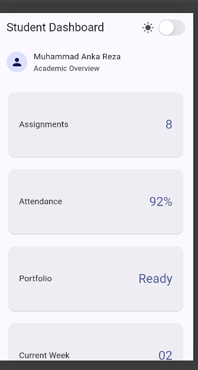


Output analyzer:

```text
Analyzing main2.dart...
No issues found!
```
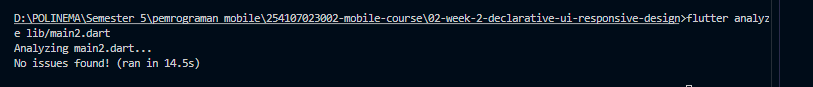

### Testing dasar

Perintah pengujian yang digunakan:

```bash
flutter test
```

Hasil pengujian:

```text
00:10 +2: All tests passed!
```

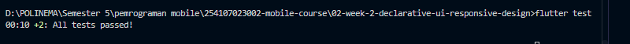

### Refleksi dan referensi

1. perbedaan imperative dan  declarative 

jawab : imperative menjelaskan langkah langkah yang harus dilakukan untuk membangun atau mengubah tampilan, sementara declarative menjelaskan hasil tampilan yang diinginkan berdasarkan data dan kondisi tertentu

2. kegunaan ekspanded dan penyebab layout error  

jawab : expanded membantu widget mengisi ruang kosong yang tersedia didalam row atau coloumn 

3. pengaruh breakpoint dan theme terhadap pengalaman pengguna 

jawab : breakpoint menentukan kapan layout berpindah dari satu kolom menjadi 2 kolom. pada layar sempit, satu kolom membuat konten lebih mudah dibaca pada layar lebar, dua kolom memanfaatkan ruang layar dengan efisien, theme memengaruhi warna, kontras, dan keterbacaan

4. verifikasi rekomendasi AI 

jawab : Setelah tugas inti selesai, saya memverifikasi rekomendasi AI dengan menjalankan aplikasi pada layar sempit dan lebar. Hasilnya, layout menampilkan satu kolom di bawah breakpoint 600px dan dua kolom pada layar yang lebih lebar. Saya juga memeriksa aksesibilitas menggunakan Semantics, memastikan widget yang digunakan tersedia di Flutter stable, menjalankan flutter analyze, dan menjalankan flutter test. 

hasil:


