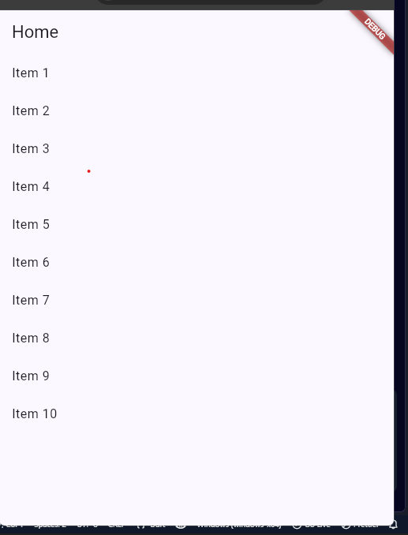
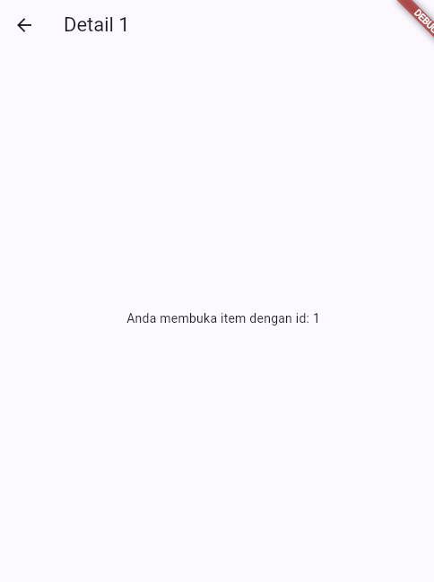
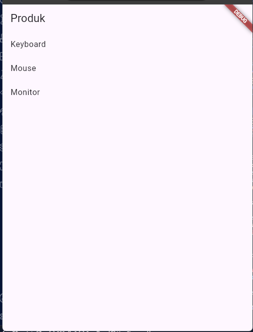
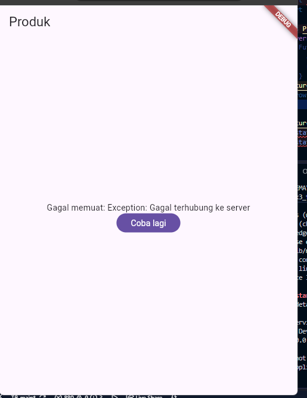
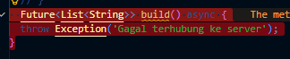
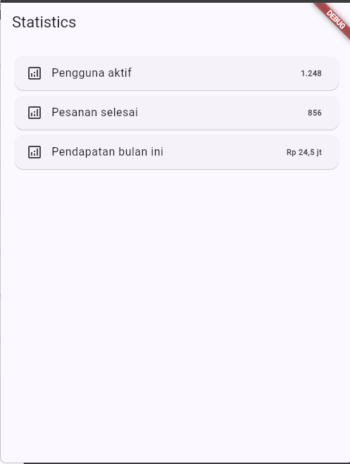

# 02 Week 2 - Declarative UI & Responsive Design
pada pertemuan kali ini saya akan mempelajari tentang konsep navigasi,route dan perbedaan navigator1 dengan gorouter, kemudian menerapkan navigasi multi page dengan GoRouter, termasuk passing argument dan deeplink sederhana, selain itu disini akan dijelaskan cara kerja Riverpod (Provider, ConsumerWidget, Notifier), dan  AsyncValue untuk menangani state loading, error, dan success pada UI

# Konsep navigasi dan GoRouter

## Navigation dasar di Flutter
Navigasi adalah mekanisme berpindah antar layar. Di Flutter, setiap layar adalah route yang ditumpuk pada Navigator (stack). Cara lama (Navigator 1.0) menggunakan Navigator.push dan Navigator.pop:

| Konsep | Penjelasan |
|---|---|
| `GoRoute` | Definisi path dan widget tujuan, misalnya `/` atau `/detail/:id`. |
| `context.go()` | Pindah route dengan mengganti stack, cocok untuk redirect login. |
| `context.push()` | Menumpuk route baru di atas stack, cocok untuk halaman detail. |
| Path parameter | Nilai dinamis pada path, diakses melalui `state.pathParameters`. |
| `extra` | Mengirim objek antar-route; gunakan dengan hati-hati karena tidak tersimpan saat proses restart web. |
| `redirect` | Guard navigasi terpusat, misalnya untuk memeriksa status login. |

### Praktikum 1 — Aplikasi multi-page dengan GoRouter

Jalankan dan amati. Buka item, lalu tekan tombol back sistem. Perhatikan bahwa path berubah mengikuti layar aktif, path yang sama juga dapat diakses langsung tanpa melewati Home. Inilah keunggulan router deklaratif dibanding Navigator 1.0.

#### Hasil pengamatan

Gambar 1. Halaman Home menampilkan daftar item. Saat `Item 1` dipilih, aplikasi menavigasi dari path `/` ke path `/detail/1` menggunakan parameter `id`.

Gambar 2. Halaman Detail menampilkan item yang dipilih dengan ID `1`. Tombol back sistem mengembalikan pengguna ke halaman Home dan path kembali ke `/`. Halaman ini juga dapat dibuka langsung melalui `/detail/1`, tanpa harus melewati Home, karena route telah didefinisikan oleh GoRouter.

## State management dengan Riverpod

### Mengapa perlu state management?

`setState` cukup untuk state lokal, tetapi state yang dibagikan antarhalaman dapat menyebabkan *prop drilling* dan kode yang rumit. State management memisahkan state dari widget agar:

- UI dibangun konsisten dari state yang sama;
- logika mudah diuji tanpa membangun UI;
- state tetap tersedia meskipun widget tidak sedang tampil.

Pada materi ini digunakan Riverpod karena compile-safe, tidak bergantung pada `BuildContext`, dan mudah diuji.

Konsep inti Riverpod

| Konsep | Penjelasan |
|---|---|
| `ProviderScope` | Wadah global yang menyimpan semua provider, membungkus root aplikasi. |
| `Provider` | Nilai read-only/immutable (misal konfigurasi, service). |
| `Notifier` + `NotifierProvider` | State yang bisa berubah melalui method; UI memanggil method, bukan mengubah state langsung. |
| `ConsumerWidget` | Widget yang bisa membaca provider lewat `ref`. |
| `ref.watch` vs `ref.read` | `watch`: build ulang saat state berubah (di dalam `build`). `read`: sekali baca (di callback/event). |

### Praktikum 2 — Aplikasi ToDo dengan Riverpod

#### Hasil pengamatan

Gambar 1. Halaman awal aplikasi ToDo menampilkan pesan bahwa daftar tugas masih kosong. Tampilan ini menunjukkan state awal aplikasi sebelum ada tugas yang ditambahkan.

Gambar 2. Saat tombol tambah ditekan, aplikasi menampilkan dialog untuk memasukkan judul tugas baru. Setelah input diisi dan tombol Tambah ditekan, data tugas akan masuk ke state provider dan tampil pada daftar utama.

Gambar 3. Setelah tugas ditambahkan, aplikasi menampilkan daftar tugas dengan opsi checklist untuk menandai tugas selesai dan tombol hapus untuk menghapus item. Perubahan ini terjadi secara reaktif melalui Riverpod saat state berubah.

## AsyncValue: loading, error, success
Banyak state berasal dari proses asinkron (membaca database, memanggil API). UI harus menampilkan tiga kemungkinan: loading (proses berjalan), error (gagal), dan success (data siap). Mengelola tiga flag boolean secara manual rawan kesalahan (isLoading dan hasError bisa tidak konsisten).

### AsyncValue
Riverpod menyediakan AsyncValue<T> yang memodelkan ketiga kondisi tersebut dalam satu tipe

### Praktikum 3 — Uji ketiga state

1. Salin kode di atas ke project ToDo Anda (atau project terpisah) dan jalankan. Amati tampilan loading selama 2 detik pertama.
2. Ubah build() sementara untuk melempar error: throw Exception('Gagal terhubung ke server');. Jalankan dan amati UI error beserta tombol Coba lagi.
3. Tekan tombol Coba lagi, ref.invalidate membuat provider dijalankan ulang. Pulihkan kode, pastikan state success tampil.
4. Refleksikan: mengapa menampilkan ulang data lama (stale data) dengan indikator refresh kadang lebih baik daripada mengosongkan layar? Kapan pola itu penting?

#### Hasil pengamatan

Gambar 1. Saat provider pertama kali dijalankan, aplikasi menampilkan indikator loading selama 2 detik sebelum data ditampilkan. Ini membuktikan bahwa state asinkron ditangani dengan `AsyncLoading` sebelum data siap.

Gambar 2. Saat `build()` sengaja melempar exception, UI beralih ke state error dan menampilkan pesan `Gagal memuat` serta tombol `Coba lagi`. Hal ini menunjukkan bahwa error ditangani dengan `AsyncError` dan tidak membuat aplikasi crash.

 

Gambar 3. Setelah tombol coba lagi ditekan, provider dijalankan ulang dan state berubah menjadi success. Data produk berhasil ditampilkan dalam daftar dengan format yang rapi.

4. Menampilkan data lama dengan indikator refresh lebih baik daripada mengosongkan layar karena pengguna tetap memiliki konteks dan tidak merasa aplikasi hilang atau tidak responsif saat proses re-fetch sedang berjalan. Pola ini sangat penting pada aplikasi yang sering berinteraksi dengan jaringan, misalnya daftar produk, dashboard, notifikasi, dan tugas harian. Dengan `AsyncValue`, kita dapat menjaga UI tetap stabil sambil memberi tahu pengguna bahwa data sedang diperbarui.

## AI Challenge
### AI Prompt Challenge

Buatkan halaman Flutter bernama StatsPage menggunakan flutter_riverpod.
Requirements:
- ConsumerWidget dengan satu AsyncNotifierProvider yang mensimulasikan
  pengambilan data statistik (delay 2 detik, kadang gagal 30%).
- UI harus menangani loading (spinner), error (pesan + tombol retry),
  dan success (ListView 3 item).
- Berikan unit test untuk notifier-nya.
Jelaskan setiap bagian kode dalam komentar.

 

### AI Verification Checklist
1. Apakah state diubah secara immutable (tidak ada state.add() atau mutasi list langsung)? 
2. Apakah ref.watch hanya dipakai di dalam build, dan ref.read di callback? 
3. Apakah ketiga state AsyncValue benar-benar ditangani (bukan hanya success)? 
4. Apakah provider dideklarasikan dengan tipe eksplisit dan tidak duplikat dengan provider lain? 
5. Apakah kode AI memakai API Riverpod versi lama (StateProvider antipattern, StateNotifierProvider usang, atau 6 6 6 Consumer bertingkat yang tidak perlu)? Perbaiki ke pola Notifier/ConsumerWidget.
6. Jalankan flutter analyze dan flutter test, apakah hasil AI lolos tanpa warning?

jawab 

- State immutable: ya, tidak ada state.add() atau mutasi list langsung.
main.dart:26-29
State hanya diganti dengan:
Baris 27: state = const AsyncLoading()
Baris 28: state = await AsyncValue.guard(fetcher)

- ref.watch dan ref.read
main.dart:76-88
Baris 77: ref.watch(...) di dalam build
Baris 88: ref.read(...) pada callback Retry

- 3 state AsyncValue
main.dart:81-108
Loading: baris 82–83
Error: baris 84–89
Success: baris 90–108

- Provider bertipe eksplisit dan tidak duplikat
main.dart:32-36
Provider hanya ada satu, yaitu statisticsProvider.

- Menggunakan pola Riverpod modern
main.dart:17-30
Menggunakan AsyncNotifier, bukan StateProvider atau StateNotifierProvider.

- ConsumerWidget
main.dart:71-77
StatsPage menggunakan ConsumerWidget.

- Unit test notifier
widget_test.dart:13-59
Test success: baris 14–39
Test error: baris 41–58

- Hasil validasi
flutter analyze: No issues found
flutter test: All tests passe

docs berada di [ai_challenge/docs](./ai_challenge/docs)

## Refactoring dan testing

### Refactoring Challenge

1. Pisahkan widget bar ToDo menjadi TodoTile tersendiri agar build lebih pendek dan mudah diuji.
2. Ekstrak logika filter (misal tampilkan hanya yang belum selesai) menjadi Provider turunan yang membaca todoListProvider.
3. Integrasikan aplikasi ToDo dengan GoRouter: / untuk daftar dan /stats untuk halaman statistik, tambahkan NavigationBar untuk berpindah.

### Testing
- flutter analyze
- flutter test

# Tugas, refleksi, dan referensi

Mini project / Industry Challenge
Bangun aplikasi ToDo dengan navigasi dan Riverpod sebagai tugas minggu ini:

1. Minimal 2 halaman dengan GoRouter: daftar tugas, halaman detail/statistik.
2. State dikelola Riverpod (Notifier), UI menggunakan ConsumerWidget.
3. Tambahkan fitur simulasi asinkron dengan AsyncValue: state loading, error, dan success tampil dengan benar.
4. Sertakan minimal 1 unit/widget test yang lulus.
5. Kerjakan bagian AI Challenge dan dokumentasikan prompt, hasil AI, perbaikan, serta alasan keputusan teknis Anda.
6. Push ke repository portfolio pada folder 03-week-3-navigation-state-management/ dengan struktur lib/, test/, README.md, dan screenshots/. README menjelaskan tujuan, fitur utama, stack teknologi, cara menjalankan, dan hasil yang dicapai.

## Refleksi

1. Kapan setState masih cukup, dan kapan state harus naik ke Riverpod?
jawab :

2. Apa perbedaan context.go dan context.push, dan kapan masing-masing tepat digunakan?
jawab : 

3. Bagaimana AsyncValue mencegah bug dibanding tiga boolean terpisah?
jawab :

4. Bagian mana dari hasil AI yang Anda perbaiki, dan mengapa?
jawab :