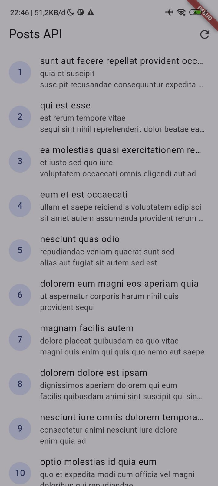
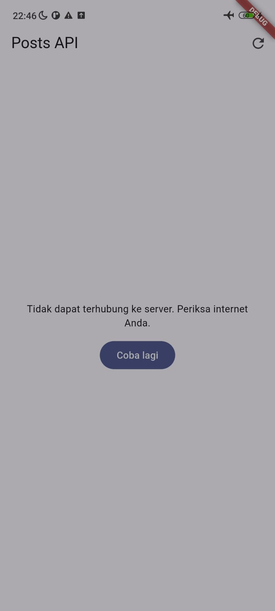
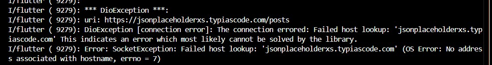
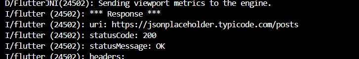

# 04-week-4-networking-rest-api

pada pertemuan kali ini saya mempelajari konsep dari HTTP, REST API DAN JSON,memetakan JSON ke model dart (serealization) dengan aman null, menerapkan repository pattern dasar sehingga UI tidak memanggil API secara langsung,mengonfigurasi Dio (base URL, timeout, interceptor) dan menangani error jaringan,menampilkan state loading, error, empty, dan success pada UI dengan AsyncValue + Riverpod,menerapkan pagination dasar (infinite scroll).

# KONSEP HTTP, REST dan JSON

# Praktikum 1 & 2 : Dio, model data & Provider, error handling

1. menjalankan aplikasi secara normal
prak2 1

Gambar pertama menunjukkan aplikasi berhasil mengambil data dari API.

2. Mematikan internet (mode pesawat) dan ketika dinyalakan kembali
prak 2 2
prak 2 3 

Gambar kedua menunjukkan kondisi ketika internet dimatikan.

Gambar ketiga menunjukkan aplikasi kembali berjalan setelah internet dinyalakan.

3. ubah BaseUrl menjadi URL salah 

prak ubahkode
prak 2 3 status

Gambar keempat menunjukkan perubahan BaseUrl menjadi URL yang salah.

Gambar kelima menunjukkan pesan error karena server tidak dapat ditemukan.

