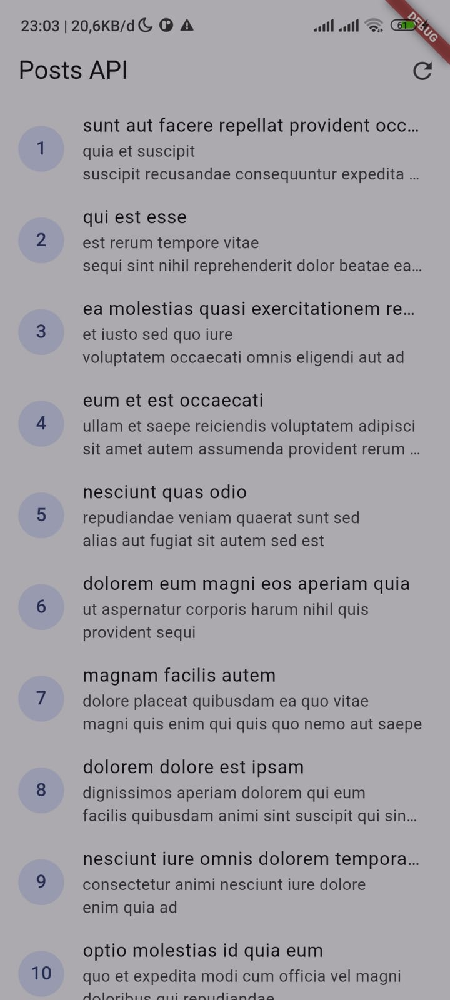
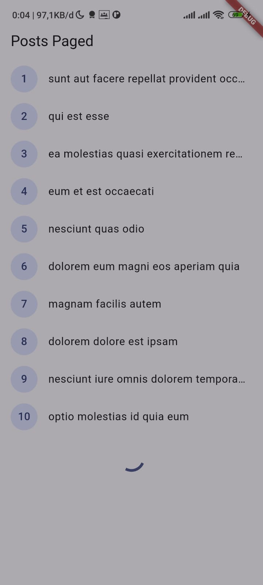
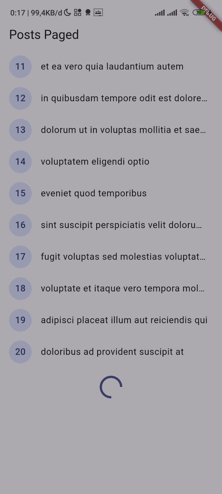

# 04-week-4-networking-rest-api

pada pertemuan kali ini saya mempelajari konsep dari HTTP, REST API DAN JSON,memetakan JSON ke model dart (serealization) dengan aman null, menerapkan repository pattern dasar sehingga UI tidak memanggil API secara langsung,mengonfigurasi Dio (base URL, timeout, interceptor) dan menangani error jaringan,menampilkan state loading, error, empty, dan success pada UI dengan AsyncValue + Riverpod,menerapkan pagination dasar (infinite scroll).

# KONSEP HTTP, REST dan JSON


# Praktikum 1 & 2 : Dio, model data & Provider, error handling

1. menjalankan aplikasi secara normal
prak2 1


Gambar pertama menunjukkan aplikasi berhasil mengambil data dari API.

2. Mematikan internet (mode pesawat) dan ketika dinyalakan kembali
prak 2 2
prak 2 3 


Gambar kedua menunjukkan kondisi ketika internet dimatikan.


Gambar ketiga menunjukkan aplikasi kembali berjalan setelah internet dinyalakan.

3. ubah BaseUrl menjadi URL salah 

prak ubahkode
prak 2 3 status

Gambar keempat menunjukkan perubahan BaseUrl menjadi URL yang salah.


Gambar kelima menunjukkan pesan error karena server tidak dapat ditemukan.y


# Praktikum 3 : Pagination dasar

Pagination membagi data API menjadi beberapa halaman agar data tidak dimuat sekaligus.
Saat pengguna mendekati bagian bawah list, aplikasi mengambil halaman berikutnya
dan menambahkan data baru tanpa menghapus data yang sudah tampil.



Gambar di atas menunjukkan halaman pagination dengan indikator loading di bagian
bawah list saat halaman berikutnya sedang dimuat.



Halaman pertama menampilkan data post nomor 1 sampai 10. Setelah list digeser
mendekati bagian bawah, aplikasi mengirim request untuk mengambil halaman kedua.



Data halaman kedua, yaitu post nomor 11 sampai 20, ditambahkan ke bawah data
sebelumnya. Proses ini berlangsung tanpa reload penuh pada aplikasi.


# AI Challenge

## AI Prompt Challenge

" Buatkan repository layer Flutter untuk endpoint GET /comments?postId={id}
dari JSONPlaceholder menggunakan Dio + flutter_riverpod.
Requirements:
- Model Comment dengan fromJson aman null (postId, id, name, email, body).
- CommentRepository dengan method fetchComments(postId) + timeout 10 detik.
- AsyncNotifierProvider dengan penanganan error otomatis (AsyncError)
  dan fungsi pesan error
  ramah pengguna untuk timeout, connection error, 404, dan 500.
- Satu unit test untuk fromJson dengan field yang hilang.
Jelaskan setiap bagian kode dalam komentar. " 

# AI verification check
1. **UI memanggil Dio langsung?**  
   Tidak. UI menggunakan `commentsProvider`, lalu provider memanggil `CommentRepository`. Dio hanya digunakan di repository.

2. **`fromJson` aman null?**  
   Ya. Field hilang/null menggunakan nilai default:
   - Angka: `0`
   - Teks: `''`

3. **Apakah semua error Dio dipetakan?**    Ya:
   - Timeout: pesan koneksi timeout
   - `connectionError`: pesan gagal terhubung
   - `404`: komentar tidak ditemukan
   - `500`: server bermasalah
   - Error lain: pesan jaringan umum

4. **Apakah `baseUrl` dan timeout terpusat?**  
   Ya. Keduanya berada di `api_client.dart` melalui `BaseOptions`:
   - `baseUrl`
   - `connectTimeout: 10 detik`
   - `receiveTimeout: 10 detik`

5. **Apakah test menguji field hilang?**  
   Ya. comment_test.dart menguji `Comment.fromJson({})` dan memastikan semua nilai default digunakan.

6. **Apakah `flutter analyze` dan `flutter test` lolos?**  
   Ya:

```text
flutter analyze
No issues found!

flutter test
All tests passed!
```

**Kesimpulan:** kode AI diterima karena pemisahan repository sudah benar,
parsing JSON aman terhadap field yang hilang, error jaringan memiliki pesan
yang sesuai, dan seluruh analyzer serta test berhasil tanpa issue.

Dokumentasi prompt, output awal AI, perbaikan, penjelasan kode, dan hasil testing:
[docs/ai-development-log.md](docs/ai-development-log.md)


# Refactoring dan testing

1. Ekstrak widget baris post menjadi PostTile tersendiri agar ListView.builder pendek dan mudah diuji.

Implementasi:

- Widget `PostTile` dibuat di `week4_api/lib/widgets/post_tile.dart`.
- Widget ini menerima object `Post` melalui parameter `post`.
- Tampilan nomor post, judul, dan body dipusatkan di dalam `PostTile`.
- `post_list_page.dart` dan `paged_post_page.dart` menggunakan `PostTile` di
   dalam `ListView.builder`, sehingga kode builder menjadi lebih pendek.
- Pemisahan ini membuat widget baris post lebih mudah digunakan ulang dan diuji
   secara terpisah.

Hasil pengujian setelah refactoring:

```text
flutter test
00:03 +6: All tests passed!
```

