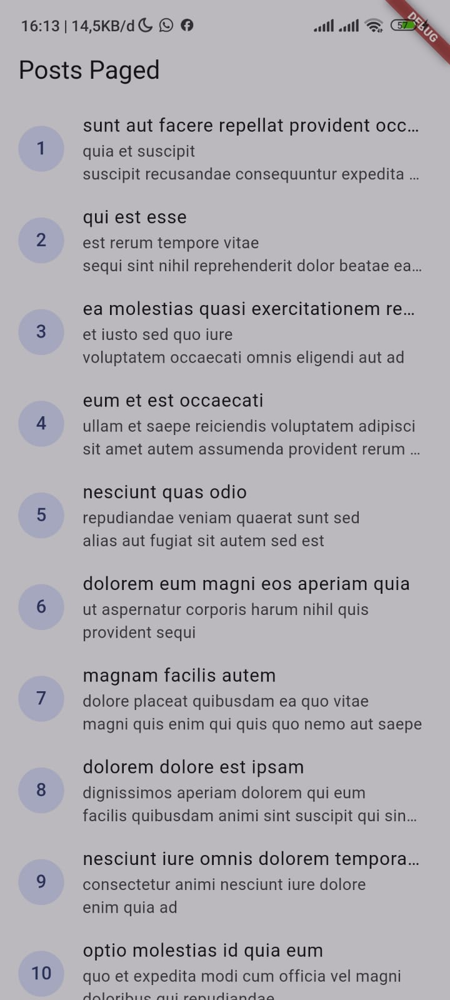

# 04-week-4-networking-rest-api

pada pertemuan kali ini saya mempelajari konsep dari HTTP, REST API DAN JSON,memetakan JSON ke model dart (serealization) dengan aman null, menerapkan repository pattern dasar sehingga UI tidak memanggil API secara langsung,mengonfigurasi Dio (base URL, timeout, interceptor) dan menangani error jaringan,menampilkan state loading, error, empty, dan success pada UI dengan AsyncValue + Riverpod,menerapkan pagination dasar (infinite scroll).

# KONSEP HTTP, REST dan JSON


# Praktikum 1 & 2 : Dio, model data & Provider, error handling

1. menjalankan aplikasi secara normal
prak2 1


Gambar pertama menunjukkan aplikasi berhasil mengambil data dari API.

2. Mematikan internet (mode pesawat) dan ketika dinyalakan kembali
prak 2 2
prak 2 3 


Gambar kedua menunjukkan kondisi ketika internet dimatikan.


Gambar ketiga menunjukkan aplikasi kembali berjalan setelah internet dinyalakan.

3. ubah BaseUrl menjadi URL salah 

prak ubahkode
prak 2 3 status

Gambar keempat menunjukkan perubahan BaseUrl menjadi URL yang salah.


Gambar kelima menunjukkan pesan error karena server tidak dapat ditemukan.y


# Praktikum 3 : Pagination dasar

Pagination membagi data API menjadi beberapa halaman agar data tidak dimuat sekaligus.
Saat pengguna mendekati bagian bawah list, aplikasi mengambil halaman berikutnya
dan menambahkan data baru tanpa menghapus data yang sudah tampil.


Gambar di atas menunjukkan halaman pagination dengan indikator loading di bagian
bawah list saat halaman berikutnya sedang dimuat.


Halaman pertama menampilkan data post nomor 1 sampai 10. Setelah list digeser
mendekati bagian bawah, aplikasi mengirim request untuk mengambil halaman kedua.


Data halaman kedua, yaitu post nomor 11 sampai 20, ditambahkan ke bawah data
sebelumnya. Proses ini berlangsung tanpa reload penuh pada aplikasi.


# AI Challenge

## AI Prompt Challenge

" Buatkan repository layer Flutter untuk endpoint GET /comments?postId={id}
dari JSONPlaceholder menggunakan Dio + flutter_riverpod.
Requirements:
- Model Comment dengan fromJson aman null (postId, id, name, email, body).
- CommentRepository dengan method fetchComments(postId) + timeout 10 detik.
- AsyncNotifierProvider dengan penanganan error otomatis (AsyncError)
  dan fungsi pesan error
  ramah pengguna untuk timeout, connection error, 404, dan 500.
- Satu unit test untuk fromJson dengan field yang hilang.
Jelaskan setiap bagian kode dalam komentar. " 

# AI verification check
1. **UI memanggil Dio langsung?**  
   Tidak. UI menggunakan `commentsProvider`, lalu provider memanggil `CommentRepository`. Dio hanya digunakan di repository.

2. **`fromJson` aman null?**  
   Ya. Field hilang/null menggunakan nilai default:
   - Angka: `0`
   - Teks: `''`

3. **Apakah semua error Dio dipetakan?**    Ya:
   - Timeout: pesan koneksi timeout
   - `connectionError`: pesan gagal terhubung
   - `404`: komentar tidak ditemukan
   - `500`: server bermasalah
   - Error lain: pesan jaringan umum

4. **Apakah `baseUrl` dan timeout terpusat?**  
   Ya. Keduanya berada di `api_client.dart` melalui `BaseOptions`:
   - `baseUrl`
   - `connectTimeout: 10 detik`
   - `receiveTimeout: 10 detik`

5. **Apakah test menguji field hilang?**  
   Ya. comment_test.dart menguji `Comment.fromJson({})` dan memastikan semua nilai default digunakan.

6. **Apakah `flutter analyze` dan `flutter test` lolos?**  
   Ya:

```text
flutter analyze
No issues found!

flutter test
All tests passed!
```

**Kesimpulan:** kode AI diterima karena pemisahan repository sudah benar,
parsing JSON aman terhadap field yang hilang, error jaringan memiliki pesan
yang sesuai, dan seluruh analyzer serta test berhasil tanpa issue.

Dokumentasi prompt, output awal AI, perbaikan, penjelasan kode, dan hasil testing:
[docs/ai-development-log.md](docs/ai-development-log.md)


# Refactoring dan testing

1. Ekstrak widget baris post menjadi PostTile tersendiri agar ListView.builder pendek dan mudah diuji.

Implementasi:

- Widget `PostTile` dibuat di `week4_api/lib/widgets/post_tile.dart`.
- Widget ini menerima object `Post` melalui parameter `post`.
- Tampilan nomor post, judul, dan body dipusatkan di dalam `PostTile`.
- `post_list_page.dart` dan `paged_post_page.dart` menggunakan `PostTile` di
   dalam `ListView.builder`, sehingga kode builder menjadi lebih pendek.
- Pemisahan ini membuat widget baris post lebih mudah digunakan ulang dan diuji
   secara terpisah.

Hasil pengujian setelah refactoring:

```text
flutter test
00:03 +6: All tests passed!
```

2. Pindahkan friendlyErrorMessage ke file lib/data/network_errors.dart agar bisa dipakai ulang halaman paged dan non-paged.

Implementasi:

- Fungsi `friendlyErrorMessage` dipindahkan ke `week4_api/lib/data/network_errors.dart`.
- `post_list_page.dart` mengimpor `../data/network_errors.dart` untuk menangani
   error pada halaman non-paged.
- `paged_post_page.dart` mengimpor file yang sama untuk menangani error pagination.
- Fungsi ini memetakan timeout, connection error, status 404, status 500, dan
   error jaringan lainnya menjadi pesan yang mudah dipahami pengguna.
- Fungsi lama di `providers.dart` dihapus agar tidak terjadi duplikasi.

Hasil validasi:

```text
flutter analyze
No issues found!

flutter test
00:02 +6: All tests passed!
```

3. Tambahkan halaman detail post dengan GoRouter (`/post/:id`).

Dependency `go_router` ditambahkan pada `week4_api/pubspec.yaml` sejajar dengan
dependency `dio` dan `flutter_riverpod`:

```yaml
dependencies:
   dio: ^5.11.1
   flutter_riverpod: ^3.4.3
   go_router: ^16.3.0
```

Dependency dipasang dengan perintah:

```powershell
flutter pub get
```

Hasilnya:

```text
Got dependencies!
```

Pesan bahwa beberapa package memiliki versi lebih baru bukan error. Versi yang
digunakan tetap mengikuti batasan dependency pada `pubspec.yaml`.

Implementasi halaman detail:

- Route `/post/:id` ditambahkan menggunakan GoRouter di `lib/main.dart`.
- `PostTile` membuka detail dengan `context.push('/post/${post.id}')`.
- `PostDetailPage` menampilkan `title` dan `body` lengkap.
- `post_detail.dart` mencari post dari list yang sudah dimuat terlebih dahulu.
- Jika post belum tersedia di list, data diambil melalui repository dengan
   endpoint `/posts/{id}`.
- Halaman detail menangani state loading, error, dan data.

Pengujian manual dilakukan dengan menekan salah satu baris post. Aplikasi harus
membuka halaman `Post Detail`, menampilkan isi lengkap post, dan tombol kembali
Android mengembalikan pengguna ke daftar post.

Bukti tampilan:


Gambar ini menunjukkan state error ketika aplikasi tidak dapat terhubung ke
server dan menyediakan tombol `Coba lagi`.



Gambar ini menunjukkan daftar post yang berhasil dimuat. Pengguna dapat menekan
salah satu baris post untuk membuka halaman detail.


Gambar ini menunjukkan halaman `Post Detail` yang menampilkan `title` dan `body`
lengkap dari post yang dipilih.


# Mini project / Industry Challenge

Mini project ini merupakan pengembangan dari project Flutter yang sudah dibuat
sebelumnya. Fitur daftar post dan struktur dasar aplikasi dipertahankan, lalu
dikembangkan dengan pengelolaan data REST API yang lebih terstruktur.

## Fitur yang Dipertahankan

- Menampilkan daftar data post dari JSONPlaceholder `/posts`.
- Menggunakan Dio untuk request HTTP.
- Menggunakan Riverpod untuk state management.
- Menampilkan state loading, error, empty, dan success.

## Fitur yang Ditambahkan

- Repository layer agar UI tidak memanggil Dio secara langsung.
- Model `Post` dengan `fromJson` yang aman terhadap field null atau hilang.
- Konfigurasi Dio terpusat, meliputi `baseUrl`, timeout, dan interceptor logging.
- Error handling dengan pesan yang lebih mudah dipahami dan tombol retry.
- Pagination server dengan 10 data per halaman menggunakan `_page` dan `_limit`.
- Infinite scroll dengan guard untuk mencegah request ganda.
- Widget reusable `PostTile` untuk menampilkan satu baris post.
- Pemisahan helper error ke `lib/data/network_errors.dart`.
- Halaman detail post dengan route `/post/:id` menggunakan GoRouter.
- State detail mengambil data dari list yang sudah dimuat atau repository jika
   post dibuka langsung melalui route.
- Unit test model dan provider menggunakan repository palsu.

## Stack Teknologi

- Flutter dan Dart
- Dio
- flutter_riverpod
- GoRouter
- JSONPlaceholder REST API
- flutter_test

## Cara Menjalankan

Jalankan perintah berikut dari folder `week4_api`:

```powershell
flutter pub get
flutter run
```

Untuk memeriksa kualitas kode dan menjalankan test:

```powershell
flutter analyze
flutter test
```

## Hasil yang Dicapai

Aplikasi berhasil menampilkan daftar post dari REST API, memuat data berikutnya
saat pengguna melakukan scroll, menampilkan detail post, menangani kegagalan
koneksi, dan mempertahankan data lama saat proses pagination mengalami error.
Validasi akhir menunjukkan analyzer tidak memiliki issue dan seluruh test lulus.


# Refleksi
1. Mengapa UI dilarang memanggil Dio langsung? Apa yang rusak jika aturan ini dilanggar?
 Jawab : karena UI hanya bertanggung jawab menampilkan data dan menerima interaksi pengguna.
 jika Ui memanggil dio langsung maka akibatnya : 
- Sulit melakukan perubahan baseUrl dan timeout.
- Penanganan error menjadi tidak konsisten.
- Widget sulit diuji tanpa koneksi internet.
- Terjadi duplikasi kode.
- UI menjadi bergantung langsung pada library Dio.

2. Kapan pagination client-side cukup, dan kapan harus mengandalkan pagination server (_page/_limit)?
jawab : pagination client side cukup jika jumlah data kecil dan seluruh data aman untuk dimuat sekaligus. Pagination server lebih tepat jika data sangat banyak

3. Bagaimana exception repository berubah menjadi AsyncError tanpa try/catch di setiap widget? Kapan try/catch eksplisit tetap dibutuhkan?
jawab : AsyncNotifier menjalankan method build() secara asynchronous. Jika repository melempar exception, Riverpod secara otomatis menyimpan exception tersebut ke dalam state AsyncError.
try/catch eksplisit tetap diperlukan jika aplikasi ingin:
- Mengubah state secara manual.
- Menyimpan data lama saat request berikutnya gagal.
- Menampilkan retry khusus.
- Menjalankan logging atau tindakan tambahan.
- Menangani beberapa jenis exception secara berbeda.

4. Bagian mana dari hasil AI yang Anda perbaiki, dan mengapa?

jawab :
Pada hasil awal AI Challenge, struktur model, repository, provider, dan unit test sudah dibuat. Namun, beberapa bagian perlu diperbaiki setelah disesuaikan dengan project:

- fromJson dipastikan aman ketika field JSON hilang atau bernilai null, sehingga aplikasi  tidak mengalami crash.
- friendlyErrorMessage dipindahkan ke lib/data/network_errors.dart agar dapat digunakan     kembali oleh halaman paged dan non-paged.
- Provider disesuaikan dengan versi Riverpod yang digunakan dalam project.
- Test ditambahkan untuk menguji kondisi edge case ketika semua field JSON hilang.
- Test widget bawaan Flutter yang masih menguji counter diganti agar sesuai dengan halaman pagination.
- Test widget menggunakan ProviderScope dan fake notifier supaya tidak melakukan request API sungguhan.
- Import package diperbaiki agar konsisten dengan nama package praktikum.
- Timeout dan baseUrl dipastikan tetap menggunakan konfigurasi Dio terpusat.

